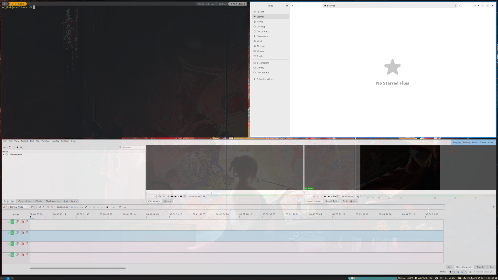
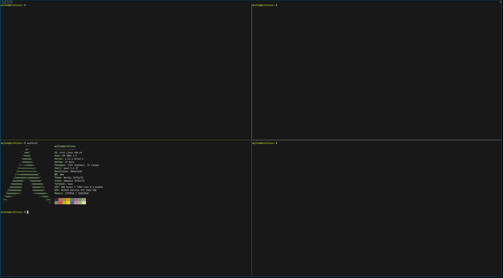
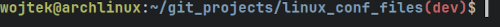
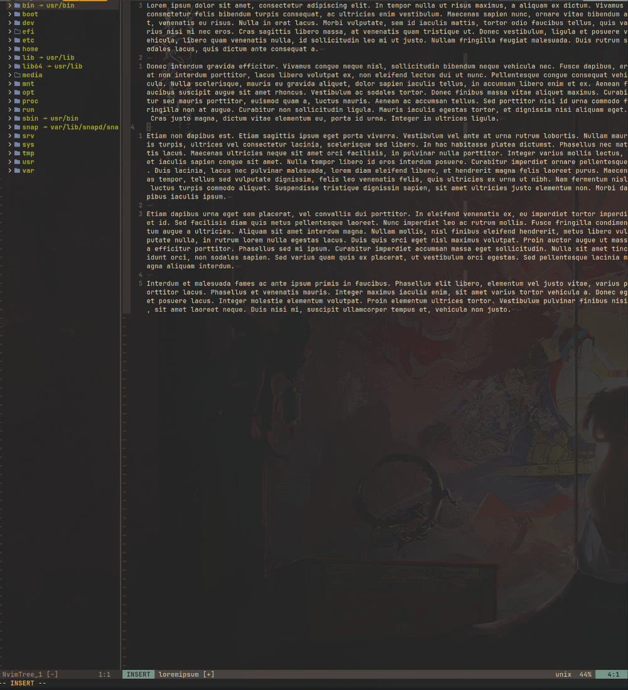
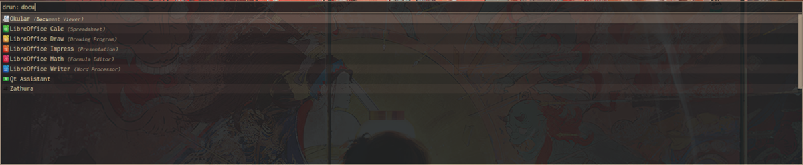

# My linux configuration files

`make install` - install config

`make backup` - backup config

## Alacritty

**Requires**: [JetBrains Mono Nerd Font
](https://www.nerdfonts.com/font-downloads)

## i3 and Picom

#### i3status-rust bar


#### i3wm + Picom


## TMux


## bashrc


## NeoVim


## Rofi


## Git ssh

Git configuration to detect the ssh key: `~/.ssh/github`
```
Match host=gitlab.com
   User git
   Hostname gitlab.com
   IdentityFile ~/.ssh/github
   TCPKeepAlive yes
   IdentitiesOnly yes
   AddKeysToAgent yes

Match host=github.com
   User git
   Hostname github.com
   IdentityFile ~/.ssh/github
   TCPKeepAlive yes
   IdentitiesOnly yes
   AddKeysToAgent yes
```
